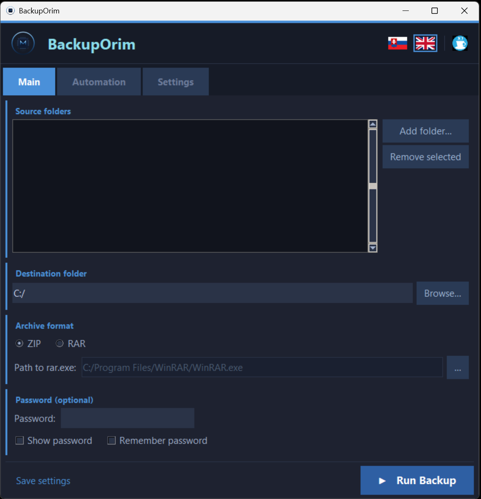
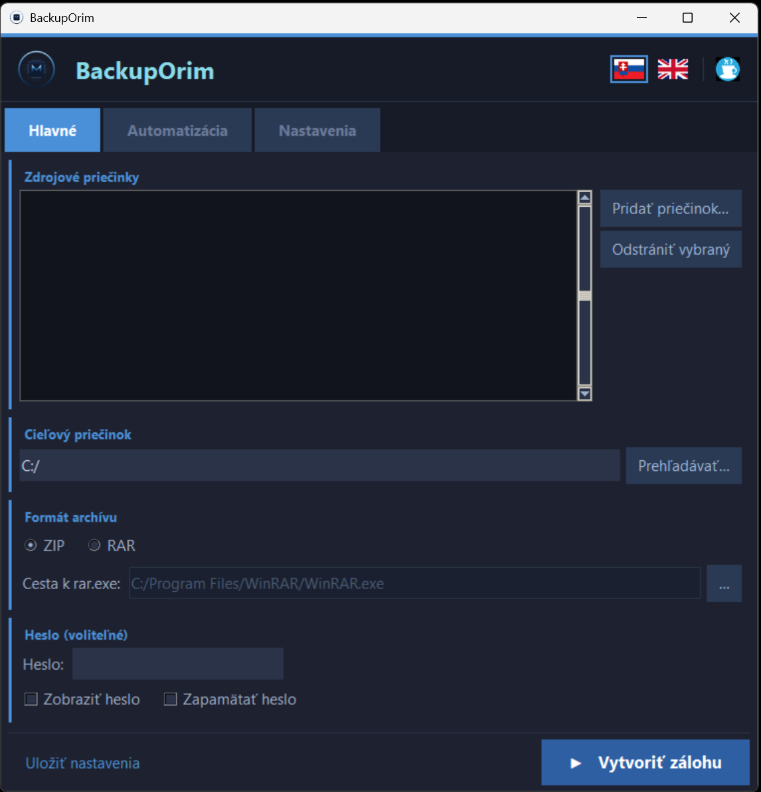

<div align="center">
  
  <h1>BackupOrim</h1>
  <p>Simple folder backup tool for Windows — ZIP / RAR, encryption, scheduling, system tray.</p>

  [](https://github.com/Orimslav/Backup_tool/actions)
  [](https://github.com/Orimslav/Backup_tool/releases/latest)
  
  [](https://ko-fi.com/orimslav)
  [](LICENSE)
</div>

---

🇬🇧 [English](#english) · 🇸🇰 [Slovenčina](#slovenčina)

---

## English

### Download

> **No Python required** — single portable `.exe` (~20 MB), runs on Windows 10 / 11 out of the box.

**➡ [github.com/Orimslav/Backup_tool/releases/latest](https://github.com/Orimslav/Backup_tool/releases/latest)**

[](https://github.com/Orimslav/Backup_tool/releases/latest)

1. Open the link above → scroll to **Assets** → click **`BackupOrim.exe`**
2. Save and double-click — no installation, no Python, nothing else needed
3. On first launch Windows SmartScreen may appear → click **"More info" → "Run anyway"**

> The `.exe` is built automatically by GitHub Actions (Python 3.12, Windows runner) every time a new version tag is pushed. You can inspect the build in the [Actions tab](https://github.com/Orimslav/Backup_tool/actions).

### Screenshot



### Features

- **Multiple source folders** — add as many folders as you need; each is archived independently
- **ZIP and RAR** — ZIP with AES-256 encryption (`pyzipper`); RAR via external `rar.exe` (WinRAR)
- **Optional password** — encrypts archive contents and file names; never saved to logs
- **Cleanup policies** — keep last N backups *or* delete archives older than N days, per source folder
- **Exclude patterns** — glob patterns to skip `node_modules`, `__pycache__`, `.git`, `*.tmp`, etc.
- **Integrity check** — every archive is verified right after creation; corrupt files are deleted and reported
- **Autostart**
  - Run at Windows logon (registry `HKCU\...\Run`, no admin required)
  - Run on schedule — daily / weekdays / specific days of the week
- **Shut down PC after backup** — optional checkbox to power off the PC on successful backup (60 s delay, cancellable via `shutdown /a`)
- **System tray** — minimize to tray on close; right-click menu to run backup or exit
- **Toast notifications** — configurable success / failure Windows notifications
- **Single-instance guard** — launching the app a second time brings the existing window to the front
- **Rotating log** — `%APPDATA%\OrimslavBackup\backup.log` (max 5 MB × 3 files)
- **Status bar** — last backup result always visible at the bottom of the window
- **Bilingual UI** — switch between English and Slovak at runtime with no restart

### Requirements

| Requirement | Notes |
|---|---|
| Windows 10 or 11 | Required |
| WinRAR (`rar.exe`) | Only if you use the RAR format; auto-detected in `Program Files` |

Python is **not** required to run the `.exe`.

### Command-line flags

| Flag | Description |
|---|---|
| *(none)* | Launch the GUI |
| `--autorun` | Load saved config, run backup once, exit — no GUI (used by scheduled task) |
| `--autorun --shutdown-after` | Same as `--autorun`, but shuts down the PC 60 s after a successful backup |
| `--minimized` | Start GUI hidden in the system tray |
| `--minimized --autorun` | Start GUI hidden in tray and trigger backup after 3 s (used by logon autostart) |

### Data location

All settings and logs are stored in `%APPDATA%\OrimslavBackup\`:

| File | Contents |
|---|---|
| `config.json` | User settings |
| `backup.log` | Rotating backup log |
| `last_run.json` | Result of the most recent backup run |

### Archive naming

```
<folder_name>_<YYYY-MM-DD_HH-MM-SS>.zip
```

Example: `webapp_2026-05-07_17-00-12.zip`

### Build from source

```powershell
git clone https://github.com/Orimslav/Backup_tool.git
cd Backup_tool
python -m venv .venv
.\.venv\Scripts\Activate.ps1
pip install -r requirements.txt
python backup_app.py          # run from source
```

The `.exe` is built automatically by GitHub Actions on every `v*` tag push and uploaded to GitHub Releases. To trigger a release:

```bash
git tag v1.0.0
git push origin v1.0.0
```

### Support

If you find BackupOrim useful, consider supporting the project:

[](https://ko-fi.com/orimslav)

---

## Slovenčina

### Stiahnutie

> **Python nie je potrebný** — jediný prenosný `.exe` (~20 MB), beží na Windows 10 / 11 hneď po stiahnutí.

**➡ [github.com/Orimslav/Backup_tool/releases/latest](https://github.com/Orimslav/Backup_tool/releases/latest)**

[](https://github.com/Orimslav/Backup_tool/releases/latest)

1. Otvorte odkaz vyššie → posuňte sa na **Assets** → kliknite na **`BackupOrim.exe`**
2. Uložte a spustite dvojklikom — žiadna inštalácia, žiadny Python, nič iné
3. Pri prvom spustení môže Windows SmartScreen zobraziť varovanie → kliknite **„Ďalšie informácie" → „Spustiť"**

> `.exe` sa zostavuje automaticky cez GitHub Actions (Python 3.12, Windows runner) pri každom novom verzionom tagu. Build môžete sledovať v záložke [Actions](https://github.com/Orimslav/Backup_tool/actions).

### Screenshot



### Funkcie

- **Viacero zdrojových priečinkov** — pridajte ľubovoľný počet priečinkov; každý sa archivuje samostatne
- **ZIP a RAR** — ZIP so šifrovaním AES-256 (`pyzipper`); RAR cez externý `rar.exe` (WinRAR)
- **Voliteľné heslo** — šifruje obsah aj názvy súborov; nikdy sa neukladá do logov
- **Politiky čistenia** — ponechajte posledných N záloh *alebo* odstráňte archívy staršie ako N dní, pre každý priečinok zvlášť
- **Vylúčené vzory** — glob vzory na preskočenie `node_modules`, `__pycache__`, `.git`, `*.tmp` a pod.
- **Kontrola integrity** — každý archív sa overí ihneď po vytvorení; poškodené súbory sa odstránia a nahlásia
- **Automatické spustenie**
  - Pri prihlásení do Windows (register `HKCU\...\Run`, nevyžaduje admin)
  - Podľa plánu — každý deň / pracovné dni / konkrétne dni v týždni
- **Vypnutie PC po zálohe** — voliteľný checkbox na vypnutie PC po úspešnej zálohe (60 s odklad, zrušiť: `shutdown /a`)
- **Systémová lišta** — minimalizovanie do lišty pri zatvorení; kontextové menu na spustenie zálohy alebo ukončenie
- **Toast notifikácie** — konfigurovateľné Windows oznámenia o úspechu / chybe
- **Ochrana pred viacnásobným spustením** — druhé spustenie zobrazí existujúce okno do popredia
- **Rotujúci log** — `%APPDATA%\OrimslavBackup\backup.log` (max 5 MB × 3 súbory)
- **Stavový riadok** — výsledok poslednej zálohy vždy viditeľný v spodnej časti okna
- **Dvojjazyčné rozhranie** — prepínanie medzi slovenčinou a angličtinou za behu bez reštartu

### Požiadavky

| Požiadavka | Poznámka |
|---|---|
| Windows 10 alebo 11 | Povinné |
| WinRAR (`rar.exe`) | Len pri použití formátu RAR; automaticky sa nájde v `Program Files` |

Python **nie je** potrebný na spustenie `.exe`.

### Príkazové prepínače

| Prepínač | Popis |
|---|---|
| *(žiadny)* | Spustí grafické rozhranie |
| `--autorun` | Načíta uložené nastavenia, spustí zálohu raz a skončí — bez GUI (scheduled task) |
| `--autorun --shutdown-after` | Rovnaké ako `--autorun`, ale po úspešnej zálohe vypne PC (60 s odklad) |
| `--minimized` | Spustí GUI skryté v systémovej lište |
| `--minimized --autorun` | Spustí GUI skryté v lište a po 3 s spustí zálohu (používa logon autostart) |

### Umiestnenie dát

Všetky nastavenia a logy sú uložené v `%APPDATA%\OrimslavBackup\`:

| Súbor | Obsah |
|---|---|
| `config.json` | Nastavenia používateľa |
| `backup.log` | Rotujúci log zálohovania |
| `last_run.json` | Výsledok posledného zálohovania |

### Pomenovanie archívov

```
<názov_priečinka>_<RRRR-MM-DD_HH-MM-SS>.zip
```

Príklad: `webapp_2026-05-07_17-00-12.zip`

### Zostavenie zo zdrojového kódu

```powershell
git clone https://github.com/Orimslav/Backup_tool.git
cd Backup_tool
python -m venv .venv
.\.venv\Scripts\Activate.ps1
pip install -r requirements.txt
python backup_app.py          # spustenie zo zdrojového kódu
```

`.exe` sa zostavuje automaticky cez GitHub Actions pri každom tagu `v*` a nahrá sa do GitHub Releases. Ako spustiť release:

```bash
git tag v1.0.0
git push origin v1.0.0
```

### Podpora

Ak vám BackupOrim pomáha, môžete projekt podporiť:

[](https://ko-fi.com/orimslav)

---

<div align="center">
  <sub>Made with ❤️ by <a href="https://github.com/Orimslav">Orimslav</a></sub>
</div>
